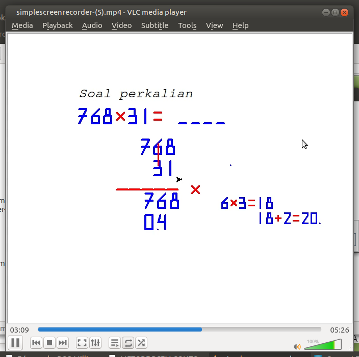

# Tutor Perkalian

Aplikasi ini sebagai alat bantu untuk mengajar anak perkalian susun ke bawah yang biasanya sudah diajarkan pada level kelas 4 di Sekolah Dasar. 

Aplikasi ini menggunakan modul utama 'turtle' ditambah text to speech 'gTTS'. 

Semoga menjadi inspirasi bagi programmer untuk mengembangkan aplikasi untuk membantu pengembangan pada bidang pendidikan.

# Video

